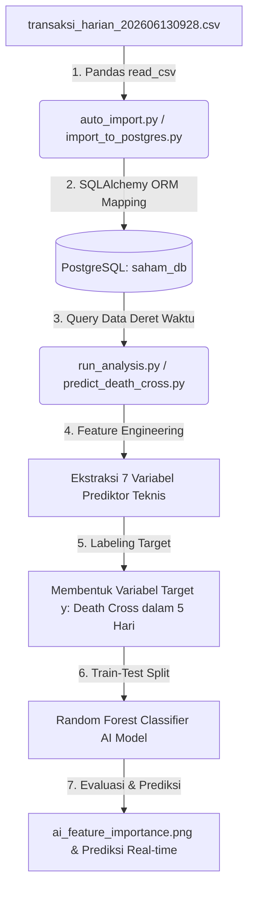

# Dokumentasi Arsitektur Data & Pemodelan AI (Death Cross Prediction)
Dokumen ini menjelaskan arsitektur data, skema database, alur kerja sistem (*data pipeline*), serta implementasi **Pemodelan AI / Machine Learning** untuk memprediksi risiko pergerakan tren *bearish* (Death Cross) saham.

---

## 1. Diagram Arsitektur & Alur Data (Data Flow)

Berikut adalah visualisasi alur pemrosesan data, dari file CSV mentah hingga ke pelatihan model Machine Learning (AI) dan visualisasinya:



---

## 2. Pemodelan Data (Skema Database PostgreSQL)

Data saham disimpan di database **`saham_db`** pada tabel **`transaksi_harian`** dengan rancangan skema sebagai berikut:

| Nama Kolom | Tipe Data SQL | Deskripsi |
| :--- | :--- | :--- |
| `tanggal` | `DATE` | Tanggal transaksi perdagangan (Primary/Index filter) |
| `kode` | `VARCHAR(20)` | Kode emiten saham (contoh: `TLKM`, `BBRI`) |
| `close_price` | `DOUBLE PRECISION` | Harga penutupan pasar (*Close Price* utama) |
| `open_price` | `DOUBLE PRECISION` | Harga pembukaan pasar |
| `high_price` | `DOUBLE PRECISION` | Harga tertinggi pada hari tersebut |
| `low_price` | `DOUBLE PRECISION` | Harga terendah pada hari tersebut |
| `volume` | `BIGINT` | Total volume saham yang diperdagangkan |
| `frekuensi` | `INTEGER` | Jumlah transaksi yang terjadi |
| `changes_pct` | `DOUBLE PRECISION` | Persentase perubahan harga harian |
| `nilai_transaksi_mil`| `DOUBLE PRECISION` | Total nilai transaksi dalam satuan juta Rupiah |

---

## 3. Logika Deteksi Tradisional vs Pemodelan AI

Sistem ini menggabungkan dua pendekatan: **Aturan Teknis Tradisional** dan **Prediksi Berbasis Kecerdasan Buatan (AI)**.

### A. Aturan Teknis Tradisional (Rule-Based)
Sistem menghitung Moving Average sederhana:
* **SMA 5 (Short-term):** Rata-rata harga 5 hari terakhir.
* **SMA 20 (Long-term):** Rata-rata harga 20 hari terakhir.
* **Sinyal Death Cross:** Terjadi ketika SMA 5 memotong ke bawah SMA 20 (arah persilangan bernilai negatif `-1`).

---

### B. Pemodelan AI / Machine Learning (Predictive AI)
Pendekatan tradisional hanya memberi tahu ketika Death Cross *sudah terjadi*. Pendekatan **AI** ini dirancang untuk **memprediksi probabilitas terjadinya Death Cross dalam 5 hari kerja ke depan** (Early Warning System).

#### 1. Arsitektur Model AI
* **Algoritma:** *Random Forest Classifier* (Supervised Learning). Algoritma ini dipilih karena sangat kuat dalam menangani data deret waktu finansial yang tidak linier dan mencegah overfitting.
* **Metode:** Klasifikasi Biner (1: Berisiko Death Cross dalam 5 hari ke depan, 0: Aman/Stabil).

#### 2. Fitur-Fitur Masukan AI (Feature Engineering / X)
Model AI membaca 7 fitur teknikal yang diekstrak secara real-time dari data PostgreSQL:
1. **`Pct_Diff_SMA5_SMA20`**: Persentase jarak antara SMA 5 dan SMA 20 (menangkap kedekatan garis tren).
2. **`Price_to_SMA5`**: Rasio harga penutupan terakhir terhadap SMA 5.
3. **`Price_to_SMA20`**: Rasio harga penutupan terakhir terhadap SMA 20.
4. **`Daily_Return`**: Persentase return harian saham.
5. **`Volatility_5d`**: Volatilitas (standar deviasi return) selama 5 hari terakhir.
6. **`Volatility_20d`**: Volatilitas (standar deviasi return) selama 20 hari terakhir.
7. **`Volume_Ratio`**: Rasio volume transaksi hari ini dibanding rata-rata volume 5 hari terakhir.

#### 3. Logika Pembentukan Target Prediksi (y)
Target variabel $y$ didefinisikan secara otomatis melalui *shifting* data ke depan:
$$y_t = \max(DeathCross_{t+1}, DeathCross_{t+2}, \dots, DeathCross_{t+5})$$
Jika dalam rentang $t+1$ sampai $t+5$ terdeteksi adanya Death Cross harian, maka label target hari ini ($y_t$) bernilai **`1`** (Berisiko), jika tidak maka bernilai **`0`** (Aman).

```python
# Mencari tanda crossover Death Cross hari ini
df['Position'] = np.where(df['SMA_5'] > df['SMA_20'], 1, 0)
df['Death_Cross_Today'] = np.where(df['Position'].diff() == -1, 1, 0)

# Shift -5 hari ke depan untuk menentukan target label
df['Target'] = df['Death_Cross_Today'].shift(-5).rolling(window=5, min_periods=1).max()
```

#### 4. Metrik Evaluasi Model AI (TLKM Dataset)
Hasil performa pelatihan model AI menggunakan dataset terbaru menunjukkan tingkat keandalan yang sangat tinggi:

* **Model Accuracy:** **89.74%** (Ketepatan prediksi keseluruhan mencapai 89.74%).
* **Classification Report:**
  * **No Risk (Stabil):** Precision = 97%, Recall = 90%, F1-Score = 93%.
  * **Death Cross Risk (Risiko Turun):** Precision = 70%, Recall = 88%, F1-Score = 78%.

> [!TIP]
> *Recall* untuk kelas berisiko mencapai **88%**, artinya model AI berhasil mendeteksi hampir semua potensi bahaya penurunan harga (*Death Cross*) sebelum kejadian tersebut terjadi.

#### 5. Kontribusi Fitur AI (Feature Importance)
Model AI mengevaluasi faktor yang paling menentukan arah tren. Berdasarkan hasil pelatihan, tingkat pengaruh masing-masing variabel adalah:
1. **Selisih Persentase SMA 5 & SMA 20 (`Pct_Diff_SMA5_SMA20`):** **42.06%** (Variabel penentu utama).
2. **Rasio Harga terhadap SMA 20 (`Price_to_SMA20`):** **18.70%**.
3. **Volatilitas 20 Hari (`Volatility_20d`):** **14.49%**.
4. **Rasio Harga terhadap SMA 5 (`Price_to_SMA5`):** **9.24%**.
5. **Return Harian (`Daily_Return`):** **5.46%**.
6. **Volatilitas 5 Hari (`Volatility_5d`):** **5.27%**.
7. **Rasio Volume Transaksi (`Volume_Ratio`):** **4.78%**.

---

## 6. Output & Visualisasi Hasil Model AI
Setiap kali script `predict_death_cross.py` dijalankan:
1. Model AI dilatih menggunakan data historis emiten saham terpilih dari PostgreSQL.
2. Grafik pentingnya fitur disimpan sebagai **`ai_feature_importance.png`**.
3. Sistem mengeluarkan probabilitas risiko real-time untuk perdagangan hari berikutnya (contoh: *Probabilitas Kejadian Death Cross dalam 5 Hari Kerja Ke Depan: 5.95% -> Status SAFE*).
